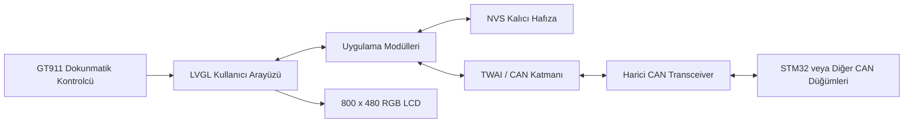

(hem logo ile açılış hem de tank level, shunt ve battery değerlerini içeriyor.)


# YatchingSystem v1.0

ESP32-S3 tabanlı, dokunmatik ekran üzerinden yat üzerindeki elektrik ve sıvı sistemlerinin izlenmesini ve kontrol edilmesini amaçlayan gömülü arayüz projesidir.

Proje; LVGL ile hazırlanan kullanıcı arayüzünü, TWAI/CAN haberleşmesini, kalıcı ayar yönetimini ve farklı sistem modüllerini tek bir uygulamada bir araya getirir.

## İçindekiler

- [Proje Hakkında](#proje-hakkında)
- [Temel Özellikler](#temel-özellikler)
- [Sistem Mimarisi](#sistem-mimarisi)
- [Donanım Gereksinimleri](#donanım-gereksinimleri)
- [Yazılım Gereksinimleri](#yazılım-gereksinimleri)
- [Proje Yapısı](#proje-yapısı)
- [Uygulama Başlangıç Akışı](#uygulama-başlangıç-akışı)
- [Arayüz Modülleri](#arayüz-modülleri)
- [CAN Haberleşmesi](#can-haberleşmesi)
- [Kalıcı Veri Yönetimi](#kalıcı-veri-yönetimi)
- [Kurulum ve Derleme](#kurulum-ve-derleme)
- [Gerçek Veriye Geçiş](#gerçek-veriye-geçiş)
- [Bilinen Sınırlamalar](#bilinen-sınırlamalar)
- [Sorun Giderme](#sorun-giderme)
- [Geliştirme Önerileri](#geliştirme-önerileri)
- [Lisans](#lisans)

## Proje Hakkında

YatchingSystem v1.0, 800 x 480 çözünürlüklü RGB LCD ve GT911 dokunmatik kontrolcüsü kullanan bir ESP32-S3 ekran sistemi için geliştirilmiştir.

Uygulamada dört ana çalışma ekranı bulunur:

1. Çıkış ve PWM kontrolü
2. Batarya izleme
3. Tank seviyesi izleme
4. Shunt akım ve gerilim izleme

Sistem açıldığında bir başlangıç logosu gösterilir. Daha önce bir yönetici şifresi tanımlanmamışsa kullanıcıdan şifre oluşturması istenir. Ardından ana kontrol arayüzü açılır.

Ayarlar, özel isimler, kanal durumları, PWM değerleri, batarya üst gerilim değerleri ve tank yapılandırmaları NVS üzerinde saklanır. Böylece cihaz yeniden başlatıldığında kullanıcı tercihleri korunur.

## Temel Özellikler

- ESP32-S3 üzerinde ESP-IDF tabanlı çalışma
- LVGL 8 tabanlı dokunmatik kullanıcı arayüzü
- 800 x 480 RGB LCD desteği
- GT911 kapasitif dokunmatik ekran desteği
- 500 kbit/s TWAI/CAN haberleşmesi
- Altı adet aç/kapat ve PWM kontrol kanalı
- Dört adet batarya izleme alanı
- Sekiz adet tank izleme alanı
- Bir ana shunt ve dört quadro shunt desteği
- İki ek batarya gerilimi göstergesi
- Ayarlar için şifre koruması
- NVS tabanlı kalıcı ayar saklama
- Başlangıç logosu ve geçiş animasyonu
- CAN bus-off durumunda otomatik kurtarma denemesi
- Batarya, tank ve shunt ekranları için yerleşik test verisi modu

## Sistem Mimarisi



### Yazılım katmanları

| Katman | Sorumluluk |
|---|---|
| `main.c` | Donanım, CAN ve grafik arayüzünün başlatılması |
| Grafik arayüz katmanı | Sayfa yönetimi, navigasyon, başlangıç ekranı ve durum alanları |
| Sayfa modülleri | Buton, batarya, tank ve shunt işlevleri |
| Ayar ve şifre modülleri | Kullanıcı ayarları ile erişim kontrolü |
| `usrCAN.c` | TWAI sürücüsü, gönderim, alım ve CAN ID yönlendirmesi |
| LCD portu | RGB panel ve GT911 dokunmatik ekranın başlatılması |
| NVS | Kullanıcı tercihlerinin kalıcı olarak saklanması |

## Donanım Gereksinimleri

### Ana donanım

- ESP32-S3 tabanlı geliştirme kartı
- 800 x 480 çözünürlüklü RGB LCD
- GT911 dokunmatik kontrolcü
- Octal PSRAM destekli donanım
- En az 8 MB flash bellek
- Uygun seviyede çalışan harici CAN transceiver
- CAN hattının iki ucunda uygun sonlandırma dirençleri
- CAN düğümleri ile ortak toprak bağlantısı

ESP32-S3 içerisindeki TWAI birimi CAN kontrolcüsüdür. Fiziksel CANH ve CANL hattına doğrudan bağlanmamalıdır; arada uygun bir CAN transceiver kullanılmalıdır.

### Projedeki temel pinler

| İşlev | GPIO |
|---|---:|
| CAN RX | 19 |
| CAN TX | 20 |
| Dokunmatik I2C SDA | 8 |
| Dokunmatik I2C SCL | 9 |
| Dokunmatik I2C frekansı | 400 kHz |

RGB panel pinleri `main/waveshare_rgb_lcd_port.c` ve `main/waveshare_rgb_lcd_port.h` içerisinde tanımlanmıştır. Farklı bir ekran kartı kullanılıyorsa bu pinlerin ve panel zamanlamalarının kullanılan donanıma göre düzenlenmesi gerekir.

## Yazılım Gereksinimleri

- ESP-IDF 5.1.0 veya daha yeni bir sürüm
- Projenin varsayılan yapılandırmasıyla uyum için tercihen ESP-IDF 5.2.x
- Python ve ESP-IDF araç zinciri
- Git
- Seri port sürücüsü
- CMake ve Ninja; ESP-IDF kurulumu ile birlikte gelir

### Bileşen bağımlılıkları

`main/idf_component.yml` içerisinde aşağıdaki bağımlılıklar tanımlıdır:

| Bileşen | Sürüm |
|---|---|
| ESP-IDF | `>=5.1.0` |
| LVGL | `>8.3.9,<9` |
| GT911 dokunmatik sürücüsü | `^1` |

Proje deposunda ayrıca yönetilen bileşenlerin yerel kopyaları `components/` dizini altında bulunur.

### Varsayılan ESP32-S3 yapılandırması

`sdkconfig.defaults` dosyasında öne çıkan ayarlar şunlardır:

- Hedef: ESP32-S3
- CPU frekansı: 240 MHz
- Flash modu: QIO
- Flash frekansı: 80 MHz
- Flash boyutu: 8 MB
- Octal PSRAM: etkin
- PSRAM frekansı: 80 MHz
- FreeRTOS tick frekansı: 1000 Hz
- LVGL görevi: çekirdek 1
- Ekran yırtılmasını azaltma desteği: etkin
- Montserrat 12, 16, 20 ve 24 yazı tipleri: etkin

## Proje Yapısı

```text
YatchingSystem_v1.0/
├── components/
│   ├── espressif__esp_lcd_touch/
│   ├── espressif__esp_lcd_touch_gt911/
│   └── lvgl__lvgl/
├── main/
│   ├── main.c
│   ├── usrCAN.c
│   ├── usrCAN.h
│   ├── usrGeneral.h
│   ├── usrGeneralDefines.h
│   ├── usrGraphicalInterface.c
│   ├── usrGraphicalInterface.h
│   ├── usrButtonPage.c
│   ├── usrButtonPage.h
│   ├── usrButtonSettingsPage.c
│   ├── usrButtonSettingsPage.h
│   ├── usrButtonPasswordPage.c
│   ├── usrButtonPasswordPage.h
│   ├── usrBatteryMonitorPage.c
│   ├── usrBatteryMonitorPage.h
│   ├── usrBatterySettingsPage.c
│   ├── usrBatterySettingsPage.h
│   ├── usrBatteryPasswordPage.c
│   ├── usrBatteryPasswordPage.h
│   ├── usrTankLevelPage.c
│   ├── usrTankLevelPage.h
│   ├── usrTankSettingsPage.c
│   ├── usrTankSettingsPage.h
│   ├── usrTankPasswordPage.c
│   ├── usrTankPasswordPage.h
│   ├── usrShuntPage.c
│   ├── usrShuntPage.h
│   ├── usrShuntSettingsPage.c
│   ├── usrShuntSettingsPage.h
│   ├── usrShuntPasswordPage.c
│   ├── usrShuntPasswordPage.h
│   ├── usrDefinePassword.c
│   ├── usrDefinePassword.h
│   ├── usrMainPage.c
│   ├── usrMainPage.h
│   ├── waveshare_rgb_lcd_port.c
│   ├── waveshare_rgb_lcd_port.h
│   ├── lvgl_port.c
│   ├── lvgl_port.h
│   ├── marine_logo.c
│   ├── marine_logo.h
│   ├── marine_logo.png
│   ├── CMakeLists.txt
│   ├── Kconfig.projbuild
│   └── idf_component.yml
├── CMakeLists.txt
├── dependencies.lock
├── sdkconfig.defaults
└── README.md
```

### Dosya grupları

#### Ana uygulama

- `main.c`: LCD, CAN ve kullanıcı arayüzü başlangıç sırasını yönetir.
- `usrGraphicalInterface.*`: Sayfaları, navigasyon çubuğunu, başlangıç logosunu ve ana ekran geçişlerini yönetir.
- `usrGeneralDefines.h`: CAN ID ve komut sabitlerini içerir.

#### Kontrol ve izleme sayfaları

- `usrButtonPage.*`: Altı çıkışın açma, kapama ve PWM kontrolü
- `usrBatteryMonitorPage.*`: Dört bataryanın gerilim ve yüzde bilgileri
- `usrTankLevelPage.*`: Sekiz tankın seviye ve litre bilgileri
- `usrShuntPage.*`: Ana ve quadro shunt verileri

#### Ayar ve güvenlik sayfaları

Her ana modül için ayrı ayar ve şifre doğrulama dosyaları bulunur. `usrDefinePassword.*`, cihaz ilk çalıştırıldığında yönetici şifresinin oluşturulmasını ve NVS üzerinde saklanmasını sağlar.

#### Donanım sürücüleri

- `usrCAN.*`: ESP32-S3 TWAI/CAN katmanı
- `waveshare_rgb_lcd_port.*`: RGB LCD ve GT911 dokunmatik ekran kurulumu
- `lvgl_port.*`: LVGL görev, zamanlayıcı ve ekran bağlantısı

## Uygulama Başlangıç Akışı

`app_main()` aşağıdaki sırayı kullanır:

1. RGB LCD ve dokunmatik ekran başlatılır.
2. TWAI/CAN sürücüsü başlatılır.
3. CAN alım görevi oluşturulur.
4. LVGL kilidi alınır.
5. Grafik arayüz başlatılır.
6. LVGL kilidi serbest bırakılır.

Grafik arayüz içerisinde:

1. Başlangıç logosu ekrana gelir.
2. Logo bir geçiş animasyonu ile gösterilir.
3. Kayıtlı şifre kontrol edilir.
4. Şifre yoksa şifre oluşturma sayfası açılır.
5. Şifre varsa buton kontrol sayfasına geçilir.
6. Alt navigasyon üzerinden diğer ekranlara erişilir.

## Arayüz Modülleri

### 1. Buton ve PWM Kontrolü

Buton ekranında altı bağımsız kontrol kanalı bulunur.

Her kanal için:

- Açık veya kapalı durum
- PWM/seviye değeri
- Düzenlenebilir kanal adı
- CAN üzerinden durum gönderimi
- CAN üzerinden PWM gönderimi
- NVS üzerinde durum ve PWM saklama

Varsayılan kanal adları `PWM-1` ile `PWM-6` arasındadır.

Bir kanal kapatıldığında CAN hattına sıfır PWM değeri gönderilir. Daha önce seçilmiş PWM değeri NVS üzerinde korunur. Kanal yeniden açıldığında kayıtlı değer tekrar kullanılabilir.

#### Buton CAN ID aralığı

| İşlem | CAN ID |
|---|---|
| Kanal 1 durum | `0x400` |
| Kanal 2 durum | `0x401` |
| Kanal 3 durum | `0x402` |
| Kanal 4 durum | `0x403` |
| Kanal 5 durum | `0x404` |
| Kanal 6 durum | `0x405` |
| Kanal 1 PWM | `0x406` |
| Kanal 2 PWM | `0x407` |
| Kanal 3 PWM | `0x408` |
| Kanal 4 PWM | `0x409` |
| Kanal 5 PWM | `0x40A` |
| Kanal 6 PWM | `0x40B` |

### 2. Batarya İzleme

Batarya ekranı dört bağımsız batarya göstergesini destekler.

Her batarya için:

- Özel batarya adı
- Gerilim bilgisi
- Kullanıcı tarafından belirlenen maksimum gerilim
- Gerilime göre hesaplanan yüzde
- Grafik gösterge
- NVS üzerinde maksimum gerilim saklama

Maksimum gerilim girişinde kabul edilen aralık 5 V ile 30 V arasındadır.

Yüzde değeri mevcut gerilimin kullanıcı tarafından belirlenen maksimum gerilime oranı ile hesaplanır:

```text
yüzde = mevcut gerilim / maksimum gerilim x 100
```

Sonuç 0 ile 100 arasında sınırlandırılır.

Gelen CAN verisinin alt 12 biti ADC değeri olarak işlenir.

#### Batarya CAN ID aralığı

| Batarya | İstek ve yanıt CAN ID |
|---|---|
| Batarya 1 | `0x300` |
| Batarya 2 | `0x301` |
| Batarya 3 | `0x302` |
| Batarya 4 | `0x303` |

Mevcut uygulamada istek ve yanıt için aynı CAN ID aralığı kullanılır. CAN ağındaki diğer düğümlerin aynı protokole göre çalışması gerekir.

### 3. Tank Seviyesi İzleme

Tank ekranı toplam sekiz tankı destekler.

Desteklenmesi planlanan sensör grupları:

- Tank 1-4: 0-190 ohm
- Tank 5-8: 30-240 ohm

Her tank için:

- Özel tank adı
- Sensör tipi
- Tank kapasitesi
- Seviye yüzdesi
- Hesaplanan litre miktarı
- Bağlantı durumu
- Son veri zamanı
- NVS üzerinde teknik yapılandırma saklama

Tank kapasitesi tanımlandıktan sonra litre bilgisi aşağıdaki şekilde hesaplanır:

```text
litre = seviye yüzdesi / 100 x tank kapasitesi
```

Mevcut kodda ADC seviye dönüşümü 0 ile 275 arasındaki değerleri doğrusal olarak yüzde 0 ile yüzde 100 arasına dönüştürür. `sensor_type` parametresi fonksiyona aktarılmasına rağmen iki sensör türü için ayrı kalibrasyon eğrileri henüz uygulanmamıştır.

Gerçek çalışma modunda üç saniye boyunca veri alınmayan bir tank bağlantısız kabul edilir ve ilgili arayüz bileşeni kaldırılır.

#### Tank CAN ID aralığı

| Tank grubu | CAN ID aralığı |
|---|---|
| Tank 1-4, 0-190 ohm | `0x320` - `0x323` |
| Tank 5-8, 30-240 ohm | `0x330` - `0x333` |

İstek ve yanıt için aynı ID aralıkları kullanılmaktadır.

### 4. Shunt İzleme

Shunt ekranında aşağıdaki veri alanları bulunur:

- Bir adet ana shunt
- Dört adet quadro shunt kanalı
- Ana shunt akım bilgisi
- Quadro shunt akım ve gerilim bilgileri
- Güç hesaplamaları
- İki batarya gerilimi
- Düzenlenebilir shunt isimleri
- Seçilebilir görünürlük ayarları

#### Quadro shunt veri yapısı

Quadro shunt yanıtlarında 32 bitlik veri aşağıdaki şekilde ayrıştırılır:

| Bit alanı | İçerik |
|---|---|
| Üst 16 bit | Gerilim, mV |
| Alt 16 bit | Akım, mA |

Uygulama bu değerleri 1000'e bölerek volt ve amper cinsine dönüştürür.

#### Shunt CAN ID aralığı

| İşlem | CAN ID |
|---|---|
| Quadro shunt 1 istek | `0x100` |
| Quadro shunt 2 istek | `0x101` |
| Quadro shunt 3 istek | `0x102` |
| Quadro shunt 4 istek | `0x103` |
| Quadro shunt 1 yanıt | `0x180` |
| Quadro shunt 2 yanıt | `0x181` |
| Quadro shunt 3 yanıt | `0x182` |
| Quadro shunt 4 yanıt | `0x183` |
| Ana shunt istek | `0x200` |
| Ana shunt yanıt | `0x280` |

## CAN Haberleşmesi

### TWAI yapılandırması

| Ayar | Değer |
|---|---|
| Çalışma modu | Normal |
| Hız | 500 kbit/s |
| TX pini | GPIO 20 |
| RX pini | GPIO 19 |
| Alım filtresi | Tüm standart mesajları kabul eder |
| Gönderim uzunluğu | 8 bayt |
| Gönderim zaman aşımı | 1000 ms |
| Alım görevi stack boyutu | 4096 bayt |
| Alım görevi önceliği | 5 |

### Gönderilen veri formatı

`sendCanHeader()` fonksiyonu 32 bitlik değeri ilk dört bayta big-endian sırada yerleştirir:

| Bayt | İçerik |
|---|---|
| 0 | Değer bit 31-24 |
| 1 | Değer bit 23-16 |
| 2 | Değer bit 15-8 |
| 3 | Değer bit 7-0 |
| 4-7 | `0x00` |

Örnek:

```text
Değer: 0x12345678
Veri:  12 34 56 78 00 00 00 00
```

### Alınan veri formatı

CAN alım görevi mesajın ilk dört baytını big-endian sırada bir `uint32_t` değere dönüştürür:

```c
receivedValue =
    ((uint32_t)data[0] << 24) |
    ((uint32_t)data[1] << 16) |
    ((uint32_t)data[2] << 8)  |
    data[3];
```

Ardından CAN ID aralığına göre ilgili modüle yönlendirir.

### Alım yönlendirmesi

| CAN ID aralığı | Hedef |
|---|---|
| `0x180` - `0x183` | Quadro shunt |
| `0x280` | Ana shunt |
| `0x300` - `0x303` | Batarya |
| `0x310` - `0x313` | 4-20 mA sensör, yalnızca log |
| `0x320` - `0x323` | Tank 1-4 |
| `0x330` - `0x333` | Tank 5-8 |

### Bus-off kurtarma

Gönderim öncesinde TWAI durumu kontrol edilir. Sürücü bus-off durumundaysa kurtarma başlatılmaya çalışılır. Sürücü durmuş durumdaysa yeniden başlatma denenir.

Bu mekanizma temel hata toparlama sağlar ancak fiziksel hat, sonlandırma, baud rate veya karşı düğüm kaynaklı sorunları ortadan kaldırmaz.

## Kalıcı Veri Yönetimi

Proje kullanıcı ayarlarını ESP32 NVS üzerinde saklar.

Başlıca saklanan veriler:

- Yönetici şifresi
- Buton açık veya kapalı durumları
- PWM değerleri
- Buton kanal isimleri
- Batarya isimleri
- Batarya maksimum gerilim değerleri
- Tank isimleri
- Tank kapasitesi
- Tank sensör tipi
- Tank yapılandırma durumu
- Shunt isimleri ve görünürlük tercihleri

### Kullanılan NVS alanlarından bazıları

| Modül | Namespace veya anahtar |
|---|---|
| Batarya yapılandırması | `battery_cfg` |
| Tank yapılandırması | `tank_config` |
| Tank yapılandırma blob anahtarı | `tank_cfg` |
| Buton durumları | `btn_states` |
| Şifre | Şifre modülündeki namespace ve string anahtarı |

### Şifre güvenliği hakkında not

Şifre mevcut uygulamada NVS üzerinde string olarak saklanır ve doğrudan karşılaştırılır. Üretim ortamında aşağıdaki iyileştirmeler önerilir:

- Şifrenin açık metin yerine tuzlanmış hash olarak saklanması
- NVS encryption kullanılması
- Başarısız deneme sınırı eklenmesi
- Gecikme veya geçici kilitleme uygulanması
- Şifre sıfırlama sürecinin güvenli biçimde tasarlanması

## Kurulum ve Derleme

### 1. Depoyu klonlayın

```bash
git clone https://github.com/AdaFirdevs1/YatchingSystem_v1.0.git
cd YatchingSystem_v1.0
```

### 2. ESP-IDF ortamını etkinleştirin

Linux veya macOS:

```bash
. $HOME/esp/esp-idf/export.sh
```

Windows PowerShell için ESP-IDF kurulum dizininizdeki export betiğini çalıştırın veya ESP-IDF PowerShell terminalini açın.

### 3. Hedefi ayarlayın

```bash
idf.py set-target esp32s3
```

### 4. Yapılandırmayı kontrol edin

```bash
idf.py menuconfig
```

Özellikle şu alanları doğrulayın:

- Flash boyutu
- PSRAM modu
- LCD çözünürlüğü
- RGB panel pinleri
- Dokunmatik I2C pinleri
- LVGL bellek ayarları
- Seri port ve yükleme ayarları

### 5. Bağımlılıkları ve yapılandırmayı yenileyin

```bash
idf.py reconfigure
```

Gerekirse temiz derleme yapın:

```bash
idf.py fullclean
idf.py reconfigure
```

### 6. Projeyi derleyin

```bash
idf.py build
```

### 7. Cihaza yükleyin

Linux örneği:

```bash
idf.py -p /dev/ttyUSB0 flash
```

Windows örneği:

```powershell
idf.py -p COM5 flash
```

Port adını kendi sisteminize göre değiştirin.

### 8. Seri monitörü açın

```bash
idf.py -p /dev/ttyUSB0 monitor
```

Yükleme ve monitörü tek komutla da çalıştırabilirsiniz:

```bash
idf.py -p /dev/ttyUSB0 flash monitor
```

Monitörden çıkmak için:

```text
Ctrl + ]
```

## Gerçek Veriye Geçiş

Depodaki mevcut kaynak kodda aşağıdaki üç modül test modunda çalışmaktadır:

- `main/usrBatteryMonitorPage.c`
- `main/usrTankLevelPage.c`
- `main/usrShuntPage.c`

Her dosyada aşağıdaki tanım bulunur:

```c
static bool TEST_MODE = true;
```

Gerçek CAN verisini kullanmak için üç dosyada da değeri `false` yapın:

```c
static bool TEST_MODE = false;
```

Ardından temiz derleme önerilir:

```bash
idf.py fullclean
idf.py build
idf.py flash monitor
```

### Test modu açıkken

- Batarya ekranı animasyonlu örnek gerilimler üretir.
- Tank ekranı örnek tank verileri üretir.
- Shunt ekranı animasyonlu akım ve gerilim verileri üretir.
- Batarya modülü gerçek CAN verisini loglayıp işleme almadan döner.
- Gerçek donanım arızası ile test verisi birbirine karıştırılabilir.

### Normal moda geçmeden önce kontrol listesi

- Tüm CAN düğümleri 500 kbit/s hızında mı?
- CANH ve CANL doğru bağlandı mı?
- Hattın iki ucunda sonlandırma var mı?
- Tüm düğümler ortak GND kullanıyor mu?
- ESP32 ile transceiver lojik seviyeleri uyumlu mu?
- Karşı düğüm doğru CAN ID ile yanıt veriyor mu?
- Gönderilen veri big-endian sırada mı?
- Yanıt çerçevesi en az dört veri baytı içeriyor mu?
- Batarya maksimum gerilimleri arayüzden tanımlandı mı?
- Tank kapasiteleri ve sensör tipleri yapılandırıldı mı?

## Bilinen Sınırlamalar

### 1. Test modları varsayılan olarak açık

Batarya, tank ve shunt ekranları gerçek donanım yerine örnek veri gösterir. Donanım entegrasyonunda bu değerlerin kapatılması gerekir.

### 2. CAN alımında veri uzunluğu doğrulaması eksik

Alım görevi ilk dört baytı doğrudan okur. `data_length_code` değeri dört bayttan küçük bir mesaj alınırsa geçersiz veya önceki bellek içeriğinin işlenme riski oluşabilir.

Önerilen kontrol:

```c
if (dataLen < 4) {
    ESP_LOGW(tag, "CAN frame too short: %u", (unsigned)dataLen);
    continue;
}
```

### 3. Sekiz baytlık shunt ayrıştırma yolu kullanılmıyor

Shunt modülünde daha kapsamlı veri işleme için ek fonksiyonlar bulunsa da mevcut CAN alım görevi yalnızca ilk dört baytı `uint32_t` olarak aktarır. Sekiz baytlık genişletilmiş veri protokolü ana alım yönlendirmesine bağlanmamıştır.

### 4. Ana shunt veri yolu tamamlanmamış

Mevcut 32 bit ana shunt ayrıştırma yolunda batarya ADC alanları işlenirken ana akım bilgisi için eksik veya geçici davranış bulunmaktadır. Karşı cihaz protokolü ile birlikte yeniden tanımlanmalıdır.

### 5. 4-20 mA sensör ekranı tamamlanmamış

`0x310` ile `0x313` arasındaki mesajlar alınır ancak yalnızca seri loga yazılır. Ayrı bir veri modeli ve arayüz sayfası henüz bulunmaz.

### 6. Tank sensör tipleri ayrı kalibre edilmiyor

0-190 ohm ve 30-240 ohm sensör türleri ayrı CAN ID gruplarına sahiptir. Buna rağmen mevcut ADC-yüzde dönüşümü iki sensör tipi için aynı doğrusal hesaplamayı kullanır.

### 7. Tank kalibrasyon yorumları ile kod arasında fark bulunuyor

Bazı yorumlarda farklı ADC üst sınırları belirtilse de aktif dönüşüm fonksiyonu `adc_max = 275` kullanır. Donanıma göre tek ve doğrulanmış bir kalibrasyon değeri belirlenmelidir.

### 8. Batarya yüzdesi doğrusal hesaplanıyor

Batarya doluluk yüzdesi gerilimin maksimum gerilime oranı ile hesaplanır. Gerçek batarya kimyasının deşarj eğrisi doğrusal olmayabilir. Kurşun-asit, LiFePO4 veya lityum iyon gibi farklı kimyalar için ayrı eğriler gerekebilir.

### 9. CAN filtresi tüm mesajları kabul ediyor

TWAI kabul filtresi geniştir. Yoğun bir CAN ağında yalnızca gereken ID aralıklarını kabul eden donanım veya yazılım filtreleri tercih edilebilir.

### 10. Şifre açık metin olarak saklanıyor

Mevcut şifre NVS string alanında doğrudan tutulur. Üretim kullanımı için hash ve NVS encryption önerilir.

### 11. Sayfa enum yapısı tutarsız

`PAGE_MAIN_MENU` enum içerisinde tutulurken `PAGE_COUNT` dört olarak tanımlanmıştır ve aktif navigasyon dört işlev sayfasına göre düzenlenmiştir. Sayfa indekslerinin sadeleştirilmesi bakım kolaylığı sağlar.

### 12. Lisans belirtilmemiş

Depoda lisans dosyası bulunmadığından kodun kullanım, değiştirme ve dağıtım koşulları açık değildir.

## Sorun Giderme

### Ekran açılmıyor

Kontrol edin:

- RGB panel pinleri kullanılan kartla uyumlu mu?
- Panel beslemesi yeterli mi?
- PSRAM etkin mi?
- Flash ve PSRAM modu kartla uyumlu mu?
- Panel zamanlamaları doğru mu?
- Backlight donanımı ayrıca kontrol gerektiriyor mu?

Komut:

```bash
idf.py menuconfig
```

### Dokunmatik ekran çalışmıyor

Kontrol edin:

- GT911 I2C adresi doğru mu?
- SDA GPIO 8 ve SCL GPIO 9 bağlantıları doğru mu?
- I2C hattında pull-up dirençleri var mı?
- Dokunmatik reset ve interrupt pinleri kullanılan karta göre tanımlı mı?
- Ekran yönü ile dokunmatik koordinat yönü eşleşiyor mu?

### CAN mesajı gönderilemiyor

Kontrol edin:

- Harici CAN transceiver kullanılıyor mu?
- TX GPIO 20 ve RX GPIO 19 doğru bağlandı mı?
- CANH ve CANL ters bağlanmış olabilir mi?
- Ortak GND var mı?
- Ağda en az bir başka aktif düğüm var mı?
- Tüm cihazlar 500 kbit/s hızında mı?
- Sonlandırma dirençleri doğru mu?
- TWAI bus-off durumuna geçmiş olabilir mi?

Seri loglarda şu ifadeleri arayın:

```text
CAN TX FAILED
BUS OFF
RECOVERING
TWAI
```

### CAN mesajları geliyor ancak arayüz değişmiyor

Kontrol edin:

- İlgili modülde `TEST_MODE` kapalı mı?
- CAN ID beklenen aralıkta mı?
- Veri en az dört bayt mı?
- Veri big-endian sırada mı?
- Batarya için alt 12 bitte ADC değeri var mı?
- Tank için doğru `0x320` veya `0x330` grubu kullanılıyor mu?
- Shunt verisinin üst ve alt 16 bit alanları protokolle uyumlu mu?

### Derleme sırasında LVGL bağımlılık hatası

```bash
idf.py fullclean
idf.py reconfigure
idf.py build
```

Gerekirse yönetilen bileşen önbelleğini ve `build/` dizinini temizleyin.

### Cihaz sürekli yeniden başlıyor

Kontrol edin:

- Yetersiz güç kaynağı
- PSRAM yapılandırması
- Ekran framebuffer bellek ihtiyacı
- Watchdog tetiklenmesi
- Geçersiz NVS verisi
- Stack taşması
- LVGL fonksiyonlarının kilit dışında çağrılması

Seri monitörde reset nedenini inceleyin:

```bash
idf.py monitor
```

### Ayarlar kaydedilmiyor

NVS hata loglarını kontrol edin. NVS sürümü veya alan problemi oluştuğunda proje bazı modüllerde NVS bölümünü silerek yeniden başlatır. Bu işlem daha önce kaydedilmiş tüm ayarların kaybolmasına neden olabilir.

## Geliştirme Önerileri

### Öncelikli teknik iyileştirmeler

1. Test modu ayarını kaynak kod yerine `menuconfig` seçeneğine taşıyın.
2. CAN mesajlarında DLC kontrolü ekleyin.
3. CAN protokolünü tek bir başlık dosyasında merkezileştirin.
4. İstek ve yanıt ID'lerini birbirinden ayırın.
5. Sekiz baytlık shunt protokolünü alım katmanına bağlayın.
6. Ana shunt veri formatını kesinleştirin.
7. 4-20 mA sensör sayfasını tamamlayın.
8. Tank sensör türleri için ayrı kalibrasyon eğrileri ekleyin.
9. Batarya kimyasına göre doluluk eğrileri ekleyin.
10. Şifreyi hash ve NVS encryption ile koruyun.
11. CAN kabul filtresini daraltın.
12. CAN hata sayaçlarını arayüzde gösterin.
13. Birim ve protokol testleri ekleyin.
14. Ekran görüntülerini README dosyasına ekleyin.
15. Lisans dosyası ekleyin.

### Önerilen CAN protokol yapısı

Daha sürdürülebilir bir protokol için her mesajda aşağıdaki alanlar tanımlanabilir:

```text
Bayt 0: Protokol sürümü
Bayt 1: Komut veya veri türü
Bayt 2: Kanal numarası
Bayt 3: Durum ve hata bitleri
Bayt 4-7: Ölçüm veya komut değeri
```

Buna ek olarak:

- Her mesajın birim bilgisi açıkça belgelenmelidir.
- Signed ve unsigned alanlar belirtilmelidir.
- Endianness tek bir standarda bağlanmalıdır.
- Ölçek katsayıları belgelenmelidir.
- Hata ve timeout davranışı tanımlanmalıdır.
- İstek ve yanıt çerçeveleri ayrı ID grupları kullanmalıdır.

## Katkıda Bulunma

Katkı sağlamak için:

1. Depoyu fork edin.
2. Yeni bir geliştirme dalı oluşturun.

```bash
git checkout -b feature/yeni-ozellik
```

3. Değişikliklerinizi yapın.
4. Projeyi derleyip donanım üzerinde test edin.
5. Açıklayıcı bir commit oluşturun.

```bash
git commit -m "Yeni özellik açıklaması"
```

6. Dalınızı gönderin.

```bash
git push origin feature/yeni-ozellik
```

7. Pull request açın.

Pull request içerisinde aşağıdaki bilgilerin bulunması önerilir:

- Değişikliğin amacı
- Etkilenen donanım ve yazılım modülleri
- Kullanılan ESP-IDF sürümü
- Test edilen kart ve ekran modeli
- CAN protokolü değiştiyse yeni mesaj yapısı
- Arayüz değiştiyse ekran görüntüsü
- Bilinen yan etkiler

## Lisans

Bu depoda henüz bir lisans dosyası bulunmamaktadır.

Projenin açık kaynak olarak kullanılacak olması durumunda uygun bir lisans seçilerek kök dizine `LICENSE` dosyası eklenmelidir. Lisans eklenene kadar kodun kopyalanması, değiştirilmesi ve dağıtılması için açık bir izin tanımlanmış değildir.
